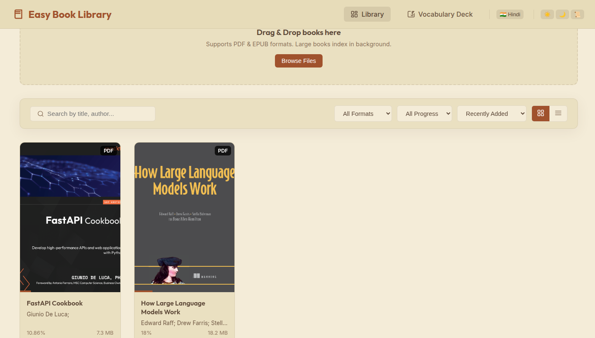

# Easy Book Library

A local ebook reader built for students. Drop your PDFs and EPUBs into one place, read them exactly as they were designed to look, and double-click any word to see what it means — no internet connection required for the reading itself, and nothing ever leaves your computer.

It runs entirely on your own machine. There's no account, no cloud sync, and no server other than the one you start yourself.

## Screenshots

**Library** — search, filter, and sort your whole collection, with covers and reading progress at a glance.



> More screenshots (the reader with a word looked up, the vocabulary deck) can be dropped into `docs/screenshots/` and added here the same way.

## What it's for

Most ebook readers are built to sell you books. This one is built to help you read the ones you already have — textbooks, papers, novels, whatever's sitting in a folder on your laptop. The two things it focuses on are:

- **A library that stays out of your way.** Drag a file in, and it shows up with a cover, a title, an author, and a progress bar. Search it, sort it, filter it by format or how far you've gotten.
- **Never getting stuck on a word.** Select any word while reading and get its meaning, part of speech, pronunciation, synonyms/antonyms, and a breakdown of its prefix/root/suffix — all without leaving the page. Every word you look up is saved automatically to your personal vocabulary deck, so it becomes a study tool over time instead of a one-off lookup.

## Features

**Library**
- Import books by drag-and-drop or the file picker (PDF and EPUB)
- Automatic cover, title, author, and page-count extraction
- Grid or list view, with search, sorting, and filtering (format, unread/in-progress/finished)
- Reading progress and "last opened" tracked per book

**Reader**
- Pages are rendered as crisp images so the book looks exactly as the author intended — nothing gets reflowed or reformatted
- Table of contents with one-click chapter jumps
- Full-text search inside the current book
- Bookmarks, plus highlights and notes you can attach to any selected passage
- Adjustable zoom, light/dark/sepia themes, and fullscreen mode

**Word meanings & vocabulary**
- Double-click a word for an instant definition, IPA pronunciation, part of speech, CEFR difficulty level, synonyms, and antonyms
- A prefix/root/suffix breakdown for the word (e.g. *unbelievable* → **un-** + **believe** + **-able**), plus an etymology trace
- Every word you look up is saved to a dedicated Vocabulary Deck you can search, filter by learning status (Learning / Review Later / Known / Mastered), and add your own study notes to
- Optional Hindi translations — toggle **🇮🇳 Hindi** in the top bar to show a Hindi meaning alongside the English one anywhere a word appears

**Read aloud**
- Text-to-speech using your browser's/OS's own voices (fully offline, works with whatever voices are already installed)
- Adjustable rate, pitch, and volume; sentence-by-sentence playback with the current sentence highlighted
- Optional auto-scroll that keeps the sentence being read in view

## Tech stack

- **Backend:** Python + FastAPI, SQLAlchemy, SQLite
- **Book parsing/rendering:** PyMuPDF (handles both PDF and EPUB) and ebooklib
- **Language features:** NLTK (sentence splitting, WordNet), `ety` (etymology)
- **Frontend:** Plain HTML, CSS, and JavaScript — no build step, no framework
- **Speech:** The browser's built-in Web Speech API

## Getting started

You'll need Python 3.11+ installed.

```bash
# 1. Clone or copy this project, then from the project root:
python3 -m venv .venv
source .venv/bin/activate      # on Windows: .venv\Scripts\activate

# 2. Install dependencies
pip install -r requirements.txt

# 3. Run it
python main.py
```

The first run downloads a small amount of NLTK language data automatically (needed for sentence splitting and dictionary lookups), so give it a few extra seconds the very first time.

Once it's running, open **http://127.0.0.1:5000** in your browser and drop a PDF or EPUB onto the library page to get started.

### A note on word lookups

Definitions come primarily from an offline Oxford word list and WordNet, so lookups work without an internet connection. If you are online, it will also check a free public dictionary API for a richer definition and pronunciation audio where available — this is best-effort and the app falls back to the offline data if it can't reach it.

## Project structure

```
app/
    api/            REST endpoints (books, vocabulary, bookmarks, notes, search, progress, settings, speech)
    core/           App configuration and constants
    database/       SQLAlchemy engine/session setup
    models/         Database tables
    schemas/        Request/response validation
    services/       The actual logic: PDF/EPUB parsing, dictionary lookups, search, library management
    static/         CSS, JavaScript, book files, and generated covers
    templates/      The three pages: library, reader, vocabulary deck
    tests/          API test suite
main.py             Entry point (python main.py to start the server)
requirements.txt    Everything needed to run it
```

## Running the tests

```bash
pytest app/tests/
```

## A few things worth knowing

- Everything is stored locally in `app/database/reader.db` (SQLite) and `app/static/books/` — back these up if your library matters to you.
- The app never modifies your original book files; it copies them into its own storage folder on import and reads from that copy.
- This is a personal/local tool rather than a multi-user product — it's meant to be run by one person on their own machine, not deployed as a public web service.
